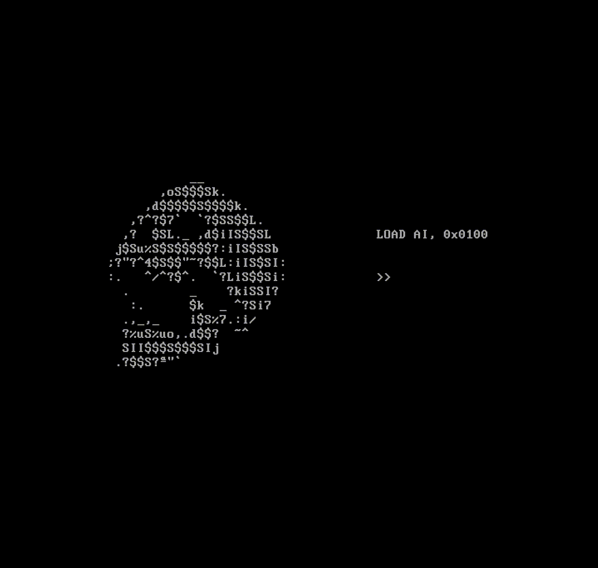

<h1 align="center"> Ander :) </h1>

<table>
<tr>
<td width="60%">

```console
anderson@github:~$ whoami
Anderson Bezerra Silva

anderson@github:~$ current_job
Linux/Kubernetes Squad @ T-Systems do Brasil
→ Mercedes-Benz do Brasil

anderson@github:~$ skills
Python • Linux • Kubernetes • Observabilidade
Automação • Infraestrutura como Código • Cloud

anderson@github:~$ education
Ciência da Computação - UAM

anderson@github:~$ contact
📧 andersoncomercial@pm.me
🌎 https://oander.site

anderson@github:~$ ./explore-projects.sh
🚀 Confira meus projetos abaixo!
```

</td>

<td width="40%">



</td>
</tr>
</table>

## 🧠 Tecnologias & Ferramentas


<div align="center">
 <!--
 <a href="https://github.com/oanderoficial">
  <!–-


  -->
  </div>

## Estatísticas do perfil 
 
|  |  |  |
| :-: | :-: | :-: |


---

## 🏆 Treinamentos e Certificações

-  Commvault Certified Professional - 2025
-  MongoDB Python Developer Path - 2025 
-  AiOps foundations - BigPanda - 2024 
-  New Relic Observability foundations - 2024 
-  Trilha Orquestração de containers - O2B - 2024 
-  Programação com Python - Impacta Tecnologia - 2024 
-  Architecting on AWS - Green Tecnologia - 2024 
-  Oracle Cloud infrastructure 2023 Certified Foundations Associate 
-  Inteligência artificial e ferramentas avançadas de ciência de dados - Universidade Presbiteriana Mackenzie - 2021
-  Tomada de decisões guiadas por dados - Universidade Presbiteriana Mackenzie - 2021
-  AWS Cloud Practitioner Essentials (segunda edição) - 2020

---
